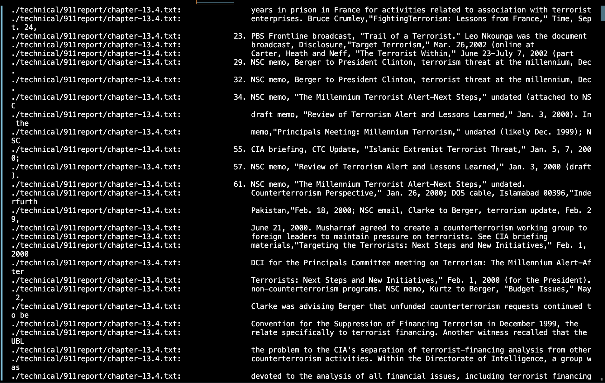
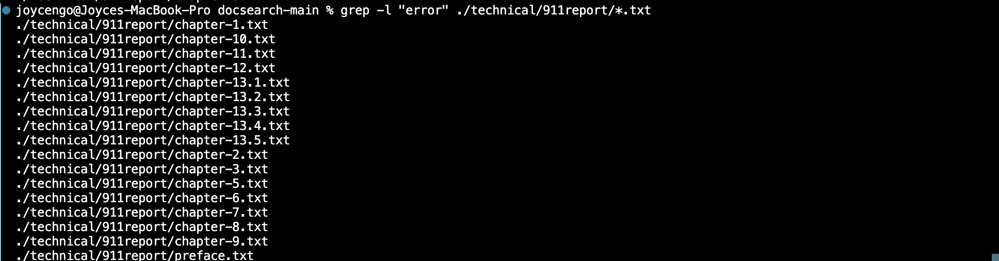

# LAB REPORT 3
# Name: Duong Ngo
# Professor: Joe Gibss Politz

# <u> Task 1:
Bug: Reversed method implementation
* A failure-inducing input:

```
 static int[] reversed(int[] arr) {
    int[] newArray = new int[arr.length];
    for(int i = 0; i < arr.length; i += 1) {
      arr[i] = newArray[arr.length - i - 1];
    }
    return arr;
  }
```
* An input that doesn't induce a failure:

```
 static int[] reversed(int[] arr) {
    int[] newArray = new int[arr.length];
    for(int i = 0; i < arr.length; i += 1) {
      newArray[i] = arr[arr.length - 1 - i];
    }
    return newArray;
  }

```

* The symptom, as the output of running the tests (provide it as a screenshot of running JUnit with at least the two inputs above):
<u> The first output is: (failure)


<u> The second output is: (success)


* The bug before fixing: 
```
 static int[] reversed(int[] arr) {
    int[] newArray = new int[arr.length];
    for(int i = 0; i < arr.length; i += 1) {
      arr[i] = newArray[arr.length - i - 1];
    }
    return arr;
  }
```
* The bug after fixing:
```
static int[] reversed(int[] arr) {
    int[] newArray = new int[arr.length];
    for(int i = 0; i < arr.length; i += 1) {
      newArray[i] = arr[arr.length - 1 - i];
    }
    return newArray;
  }
```
The reason this code has logic error because here we create a new array which is the reversed version of the originial one. For example,
we have an integers array {1,2,3}, the output should be {3,2,1}. However, the bug appears because in the code block before fixing, it 
returned the original array which the caller will receive the original, unchanged array instead of the expected reversed array. Our purpose here is to return a new array with reversed order, not the original one. Therefore, instead of returning arr, I changed it to return newArray. 

# <u> Task 2:
I choose grep command:
<u> 1.The first command line option: `-i` 
It is a command line that ignores all the distinctions or difference when searching for words in a specific text files. For example, when searching 

```
grep -i "new" ./technical/911report/chapter-8.txt
```
This will search for the word abstract regardless of uppercase or lowercase of the word. It will ignore case distinction to help the searching purpose faster.

Additionally, this method is more effective in finding errors for specific files that we want to search that is 
```
grep -i "error" ./technical/911report/*.txt
```
This will search for the word "error" in all files that end with`.txt`. Due to limited room for terminal, I will show half of the files that contain "error" in the terminal

<u> 2. The second command line option: `-r` 
It is a command line that makes grep search recursively through directories. For example, 
when using 
```
grep -r "buildings" ./technical/911report/chapter-12.txt
```
This command will find references to "buildings" across multiple files and directories as known as finding recursively. 

Or when we use 
```
grep -r "buildings" ./technical/911report/*.txt
```
This command will find references for "buildings" in all files ending with .txt with image attached below. 


<u> 3. The third command line option: `-v` 
It is a command line that inverts the match and only show lines unmatching with the given lines. In this case, I use 
```
grep -v "results" ./technical/911report/chapter-12.txt
```
This command will show all lines in chapter-12.txt file within the `./technical/911report` directory that do not contain the word "results". It is beneficial to filter out successful operations to focus on potential bugs. 


In another case, I can use 
```
grep -v "emergency" ./technical/911report/chapter-12.txt
```
This command is executed with a purpose of excluding lines with "emergency". This is when we don't want to find lines mentioning the word "emergency", thus helping to clean up views when searching for current functionality. 


<u> 4. The third command line option: `-l` 
It lists the names of files with matches instead of the matching text itself. The first example is using 
```
grep -l "Standard" ./technical/911report/*.txt
```
This command will list all the files that contain the word "Standard" instead of listing all the texts itself in each chapter. Image attached below for more illustration. 


In another case, I can use 
```
grep -l "error" ./technical/911report/*.txt
```
This command will find all the files containing "error" word. This command is effective in finding all the chapters or files with errors when we don't want to see all the texts in each file, thus creating a good organization. 


* Citation: ChatGPT and Linux terminal with the input of "command lines utilities" for `grep`


